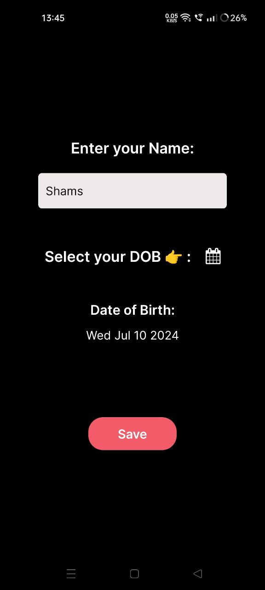
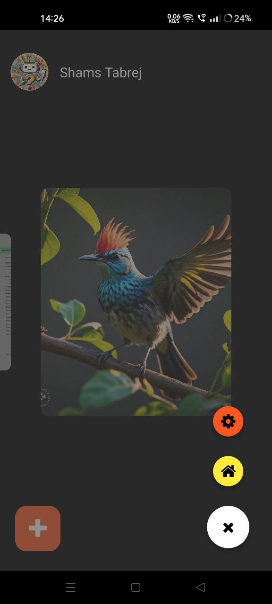

# SnapVault App

SnapVault is a React Native application designed for storing and managing photos securely. It utilizes Firebase services for user authentication, Firestore for data storage, and Firebase Storage for storing user-uploaded images.

## Features

- **Google Authentication**: Sign in with your Google account.
- **Email/Password Authentication**: Sign up and sign in using email and password.
- **Upload Photos**: Easily upload and manage your photos.
- **Log Out**: Securely log out of your account.
- **Change Name and Profile Picture**: Update your profile details and photo.

## Screenshots

<!-- Add screenshots of your app here -->
 
     
  

## APK Download

Download the latest version of SnapVault APK [here](#).

## Permissions

SnapVault requires the following permissions:

- **Internet Access:** (`android.permission.INTERNET`) Required for Firebase services like authentication and data storage.
- **Get Accounts:** (`android.permission.GET_ACCOUNTS`) Required for Google Authentication.
- **Use Credentials:** (`android.permission.USE_CREDENTIALS`) Required for Google Authentication.
- **Camera Access:** (`android.permission.CAMERA`) Required to capture photos within the app.
- **Read External Storage:** (`android.permission.READ_EXTERNAL_STORAGE`) Required to read user-uploaded photos.
- **Write External Storage:** (`android.permission.WRITE_EXTERNAL_STORAGE`) Required to save user-uploaded photos.

## Technologies Used

- **React Native:** Front-end framework for building the mobile app.
- **Firebase:** Back-end services for authentication, data storage, and file storage.
  - **Firebase Authentication:** For managing user sign in and sign up.
  - **Firebase Firestore:** For storing user data.
  - **Firebase Storage:** For storing user-uploaded images.

## Getting Started

To run this application locally, follow the instructions below:

1. Clone the repository.
2. Install dependencies using `npm install` or `yarn install`.
3. Set up Firebase project and configure Firebase credentials in the project.
4. Run the app using `npm start` or `yarn start`.

## Installation

To install the SnapVault App, follow these steps:

1. Download the APK file from the link provided above.
2. Open the downloaded file on your Android device.
3. Follow the on-screen instructions to install the app.
4. Once installed, you can start using SnapVault app to store your photos securely.

## Acknowledgements

- [React Native](https://reactnative.dev/)
- [Firebase](https://firebase.google.com/)
